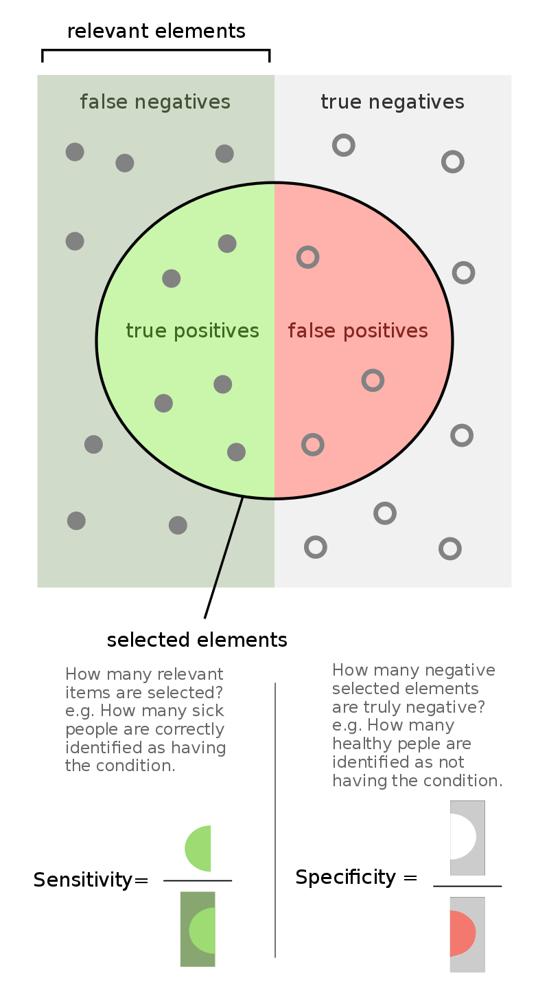

#Model Evaluation and Selection

## Introduction: What is accuracy? How to estimate or calculate it?

So far, we have heard from different techniques such as  **cross-validation**,  **holdout**, or **bootstrap** from Statistics that are use to train our model and see how well it does for the various purposes that we want.

However, sometimes it is hard to choose what Classifier, model, algorithm to use. What are the exact thigs we should be looking at when evaluation and selecting a model in Machine Learning.

## Performance of a Model

We know the deal of using the training set to create some model that eventually will measure the **accuracy** of some model when predicting on a test set. Besides, accuracy we can also test for other things such as:
- **Recall**  
- **Precision**
- **F scores**


*Source : Data Mining Concepts and Techniques, 3rd Edition by Kamber*

From above image, it is important to define some terms:

Consider an example where you live in a small town and you have to protect the town's citizens and animals from dragons. Predicting a "dragon will come" it is the Positive or target data we are looking for **(P)**. In the other hand, consider that a "no dragon is coming to town" is the negative data **(N)**.

**True Positive (TP)**: 
- Reality: "dragons came to the town"
- Predict: "dragons will come"
- Outcome: you are hero and save millions of human and animals lives from the flames of dragons

**False Positive (FP)**:
- Reality: "dragons did not come tonight"
- Predict: "dragons will come so let's evacuate the town"
- Outcome: citizens and animals are pissed off at you because you made them ecavuate in the middle of the night. Predict P when it turned out to be N.

**False Negative (FN)**:
- Realtity: "dragons came to town"
- Predict: "dragons will not come to town tonight"
- Outcome: millions of people died and animals were burned to ashes because predicting for N when it turned out to be P.

**True Negatives (TN)**:
- Reality: "dragons did not come to town tonight"
- Predict: "dragons will not come tonight"
- Outcome: People and animals are fine and nothing happened.

In real life, people don't use dragons burning or not towns as measurements for their classifiers.**Confusion Matrices** to read better this measurements and in the field of predictive analysis. The matrix or table of 2 by 2 it used to calculated more metrics in terms of proportions

Using a Confusion Matrix, accuracy is calculated by:

$$ \text { Accuracy } = \frac{TP + TN}{P + N}$$

In order to see the overall performance of a Confusion Matrix in a binary setting like the above example, we tend to look at Sensitivity (recognition rate) and Specificity 

- Sensitivity - model's ability to predict TP of each tuple.
- Specificity - model's ability to predict TN of each tuple.

Such that,

$$ \text { Sensitivity } = \frac{TP}{FN + TP} $$

$$ \text { Specificity } = \frac{TN}{FP + TN}$$




*Source : Wikipedia*


## Recall and Precision vs Sensitivity and Specificity
 
 A this point we have defined Sensitivity and Specificity, how about recall and precision? Are they similar or not? Let's see now.

**Precision** it is the measurement of exactness. 

> *How many really are positive?*

>*What proportion of positive identifications was actually correct?*

 $$\text { Precision }=\frac{T P}{T P+F P}$$

 **Recall** it is the measurement of completeness. 

 > *How many are predicted as positive?*

 > *What proportion of actual positives was identified correctly?*

 $$\text { Recall }=\frac{T P}{T P+F N}$$

 Now, 

If we define a positive example as “dragons are coming to town” we can see that Recall and Sensitivity are the same, but Precision and Specificity are different. Precision is also called recognition rate or true positive rate. From now on we will refer to sensitivity as recall.

Those definitions are pretty simple, however, I found myself confused when trying to understand what does the combination of them mean about my algorithms. How do we know which combination of them to use? What scenarios or conditions? 

**If it helps, you may refer to specificity as the recall of the same problem when the positive label is defined as negative, and the negative as positive.**

 All the measures (precision, recall, and specificity) give us important information about how well is our classification model. **It is important to look at all of them**. For example, without looking at specificity you could create a model with great precision and recall that simply predicts everything as true, and has no real value.


 ## F scores

 The F score or F1 score is another measure of a model's accuracy on a dataset. Used in binary classification systems to classify into P and N

 It's a combinatioon of Precision and Recall of the model. Thus, it is also known as the harmonic mean of Precision and Recall. In other words, this gives equal weight to Precision and Recalll

 F score is built in an harmonic mean function given by 

 $$ H=\frac{n}{\frac{1}{x_{1}}+\frac{1}{x_{2}}+\frac{1}{x_{3}}+\ldots+\frac{1}{x_{n}}}$$

 where $n$ is the number of data points in a set. This formula us the smaller of the three Pythagorean means and tends to emphasize the impact of small outliers while minimizing the impact of large outliers. When dealing with rates, the harmonic mean is considered to be the true average compared to the arithmetic average.

 We can say that the F score is a test for evaluating the performance of algorithms in information retrieval.

 It's also possible to adjust the F score to give more importance to precision over recall, or vice-versa. Common adjusted F scores are the $F_{0.5}$ score, the the $F_2$# score, and the $F_1$ score.

 General formula of F score is

 $$\begin{aligned}
F_{\beta} &=\left(1+\beta^{2}\right) \times \frac{\text { precision } \times \text { recall }}{\left(\beta^{2} \times \text { precision }\right)+\text { recall }} \\
&=\frac{\left(1+\beta^{2}\right) t p}{\left.\left(1+\beta^{2}\right) t p+\beta^{2} f n+f p\right)}
\end{aligned}$$

### When to use a specific F score?

A default $\beta$ value is 1.0, which is the same as the F score. A smaller $\beta$ value, such as 0.5, gives more weight to precision and less to recall, whereas a larger $\beta$ value, such as 2.0, gives less weight to precision and more weight to recall in the calculation of the score.

It is a useful metric to use when both precision and recall are important but slightly more attention is needed on one or the other, such as when false negatives are more important than false positives, or the reverse.

**Maximizing precision minimizes false positives and maximizing recall minimizes false negatives.**

 A factor indicating how much more important recall is than precision. For example, if we consider recall to be twice as important as precision, we can set $\beta$ to 2. The standard F score is equivalent to setting $\beta$ to one.

 ## Cross-Validation 

 Cross validation is a technique for assessing how the statistical analysis generalises to an independent data set. It is a technique for evaluating machine learning models by training several models on subsets of the available input data and evaluating them on the complementary subset of the data. Using cross-validation, there are high chances that we can detect over-fitting with ease.

 There are several cross validation techniques such as :

1. K-Fold Cross Validation
2. Leave P-out Cross Validation
3. Leave One-out Cross Validation
4. Repeated Random Sub-sampling Method
5. Holdout Method

### K-Fold Cross-Validation

First I would like to introduce you to a golden rule — “Never mix training and test data”. Your first step should always be to isolate the test data-set and use it only for final evaluation. Cross-validation will thus be performed on the training set only.

- *Step 1*: The entire training data set is broken up in $k$ equal parts. The first part is kept as the hold out (testing) set and the remaining $k-1$ parts are used to train the model.

- *Step 2*: The trained model is then tested on the holdout set.

- *Step 3*: The Step 1 and 2 are repeated $k$ times, in each case **we keep on changing the holdout set**. Thus, every data point get an equal opportunity to be included in the test set.

Usually, $k$ is number between 3 and 6. It can be extended even to higher values like 10 or 15 but it becomes extremely computationally expensive and time-consuming. An example in Python is below.

```
from sklearn.model_selection import cross_val_score
print(cross_val_score(model, X, y, cv=6))
```

We pass the model or classifier object, the features, the labels and the parameter `cv` which indicates the $k$ for K-Fold cross-validation. The method will return a list of $k$ accuracy values for each iteration. 

In general, we take the average of them and use it as a consolidated cross-validation score.

Although it might be computationally expensive, cross-validation is essential for evaluating the performance of the learning model.


 


