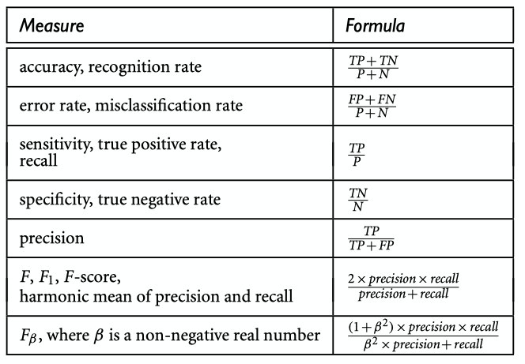

#Model Evaluation and Selection

## Introduction: What is accuracy? How to estimate or calculate it?

So far, we have heard from different techniques such as  **cross-validation**,  **holdout**, or **bootstrap** from Statistics that are use to train our model and see how well it does for the various purposes that we want.

However, sometimes it is hard to choose what Classifier, model, algorithm to use. What are the exact things we should be looking at when evaluation and selecting a model in Machine Learning.

## Performance of a Model

We know the deal of using the training set to create some model that eventually will measure the **accuracy** of some model when predicting on a test set. Besides, accuracy we can also test for other things such as:
- **Recall**  
- **Precision**
- **F scores**

*Source : Data Mining Concepts and Techniques, 3rd Edition by Kamber*

From above image, it is important to define some terms:

Consider an example where you live in a small town and you have to protect the town's citizens and animals from dragons. Predicting a "dragon will come" it is the Positive or target data we are looking for **(P)**. In the other hand, consider that a "no dragon is coming to town" is the negative data **(N)**.

**True Positive (TP)**: 
- Reality: "dragons came to the town"
- Predict: "dragons will come"
- Outcome: you are hero and save millions of human and animals lives from the flames of dragons

**False Positive (FP)**:
- Reality: "dragons did not come tonight"
- Predict: "dragons will come so let's evacuate the town"
- Outcome: citizens and animals are pissed off at you because you made them ecavuate in the middle of the night. Predict P when it turned out to be N.

**False Negative (FN)**:
- Realtity: "dragons came to town"
- Predict: "dragons will not come to town tonight"
- Outcome: millions of people died and animals were burned to ashes because predicting for N when it turned out to be P.

**True Negatives (TN)**:
- Reality: "dragons did not come to town tonight"
- Predict: "dragons will not come tonight"
- Outcome: People and animals are fine and nothing happened.

