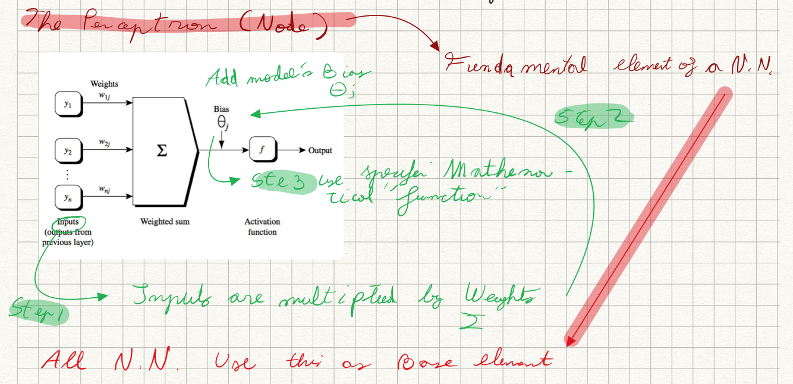

# Neural Networks Notes

## Using Sckikit-Learn

### MLPClassifier

`from sklearn.neural_network import MLPCLassifier`

**MLPClassifier** (Multi-Layer Perceptron Classifier) is the easiest way to implement a Neural Network using Scikit-Learn library.

Unlike other Classifiers found in Scikit-Learn such as Logistic Regression, SVM, and others, MLPClassifier is built in the definition of a **Perceptron**. 

In other words this Classifier is mainly built on the *input, hidden, and output layers*.

One similarity that MLPClassifier has with other Classifiers in the Scikit-Learn library is that is easy to implement in code.

#### Important parameters:
- `hidden_layer_sizes` : This allows us to set the number of layers and the number of nodes we wish to have in the Neural Network Classifier. Each element in the tuple represents the number of nodes at the $ith$ position where $i$ is the index of the tuple. Thus the length of tuple denotes the total number of hidden layers in the network.
- `max_iter`: It denotes the number of epochs.
- `activation`: The activation function for the hidden layers such as softmax or sigmoud.
- `solver`: This parameter specifies the algorithm for weight optimization across the nodes.
- `random_state`: The parameter allows to set a seed for reproducing the same results